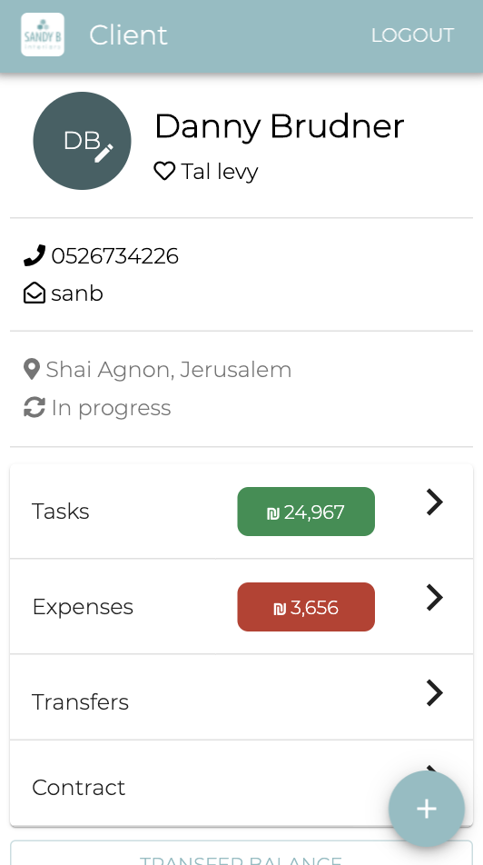

# SBInteriors

SBInteriors is a PWA built with Typescript, React, NodeJS, and MySQL for mobile. The app allows an interior design agency to track the progress, expenses, and payments throughout their clients' project. It also allows each client to view the progress of their project within their own user dashboard.

Demo: [https://sbinteriors.herokuapp.com](https://sbinteriors.herokuapp.com)

Username: `admin`

Password: `sbinteriors1999`

## Table Of Contents
- [SBInteriors](#sbinteriors)
  * [Screenshots](#screenshots)
    + [Client List](#client-list)
    + [Main Client Page (1)](#main-client-page-1)
    + [Main Client Page (2)](#main-client-page-2)
    + [Task List](#task-list)
    + [Contract Page](#contract-page)
    + [Transfer List](#transfer-list)
    + [Add Task](#add-task)
  * [Tech Stack](#tech-stack)

## Screenshots

### Client List
A list of all clients with quick access to their phone number and email address.

### Main Client Page (1)
Main dashboard to view information about the project including project status, client's balance for tasks, and balance for ongoing expenses.

### Main Client Page (2)
After scrolling down, some action buttons come into view to allow the designer to execute certain items. When clicking the hovering `+` button in the right hand corner, some hovering buttons expand to allow a designer to add tasks, expenses, etc... to a specific client.

### Task List
The list of tasks for a client incliding how long the taks took to complete, when it occured, and how much it was billed for.

### Contract Page
Each client has a contract which specifies how many hours of each type of task is included as well as how much it will cost for every additional hour.

### Transfer List
A list of transfers that the client has made to the designer to use against their balance (expenses and tasks). If their is extra in one account it can be transferred to another account by the designer (balance transfer).

### Add Task
Filling out this form will add a task for the selected client.

## Techstack
1. Typescript, React (with Hooks), Material-UI, Axios.
2. Node.js, Express, MySQL, Sequelize, Handlebars.